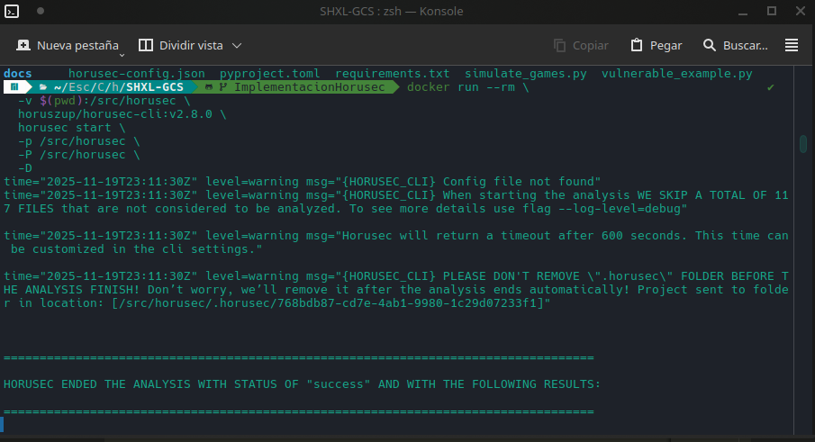
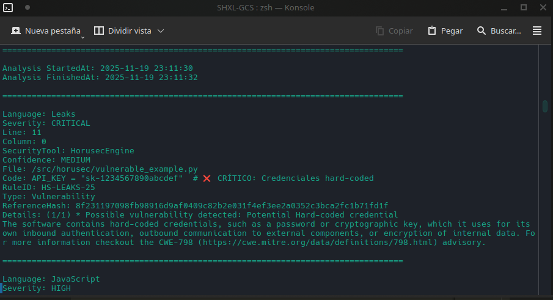
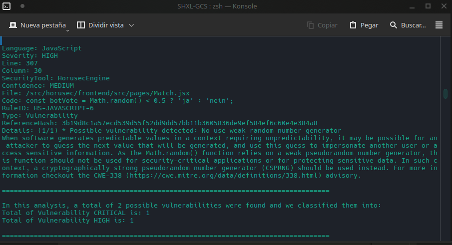
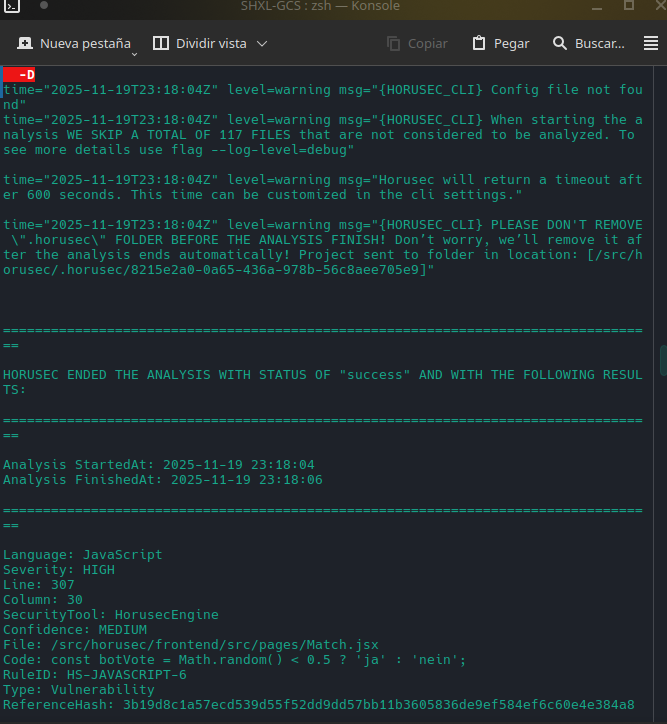
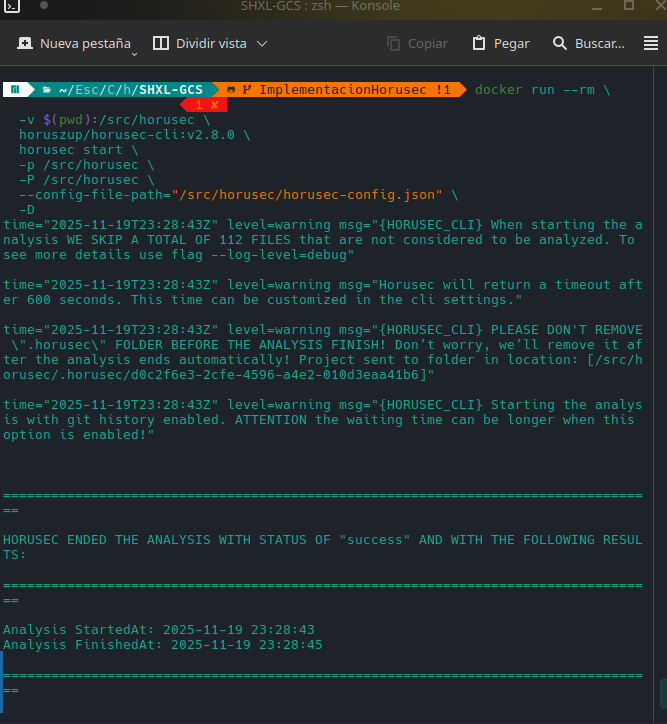
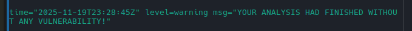

# IMPLEMENTACION Y PRUEBA DE HORUSEC LOCALMENTE
En este README se documenta la prueba de Horusec sobre el repositorio, realizando análisis locales en la computadora del integrante Franco Mamani.

## Implementacion Local

### 1. Prueba sin archivo de Configuracion.

Se ejecuta Horusec sin ningún archivo de configuración para observar qué vulnerabilidades detecta por defecto:

```bash
docker run --rm \
  -v $(pwd):/src/horusec \
  horuszup/horusec-cli:v2.8.0 \
  horusec start \
  -p /src/horusec \
  -P /src/horusec \
  -D
```
El resultado obtenido fue el siguiente:




Horusec detectó lo siguiente:

- Una vulnerabilidad CRITICAL en vulnerable_example.py por una hard-coded credential.

- Una vulnerabilidad HIGH en frontend por el uso inseguro del generador de números aleatorio
- 
### 2. Prueba con archivo de configuración para gestión de falsos positivos

Se agrega el archivo horusec-config.json para excluir la detección relacionada con el random number generator:

```json
{
  "horusecCliSeverityTypes": ["LOW", "MEDIUM", "HIGH", "CRITICAL"],
  "horusecCliPrintOutputType": "text",
  "horusecCliReturnErrorIfFoundVulnerability": true,
  "horusecCliFilesOrPathsToIgnore": [
    "**/node_modules/**",
    "**/dist/**",
    "**/build/**",
    "**/.git/**",
    "**/coverage/**"
  ],
  "horusecCliEnableGitHistoryAnalysis": true,
  "horusecCliCertInsecureSkipVerify": false,
  "horusecCliVerbose": true
}
```

Además, se elimina el contenido de vulnerable_example.py para simular un proyecto sin vulnerabilidades.

Problema encontrado

Horusec no detectaba el archivo de configuración con el comando anterior:



El problema se solucionó usando ruta absoluta en el parámetro del config file:

```bash
docker run --rm \
  -v $(pwd):/src/horusec \
  horuszup/horusec-cli:v2.8.0 \
  horusec start \
  -p /src/horusec \
  -P /src/horusec \
  --condig-file-path="/src/horusec/horusec-config.json" \
  -D
```


El resultado final, simulando que todas las vulnerabilidades fueron solucionadas, fue:



## Prueba realizando un commit en la Pull Request (GitHub Actions)

Se replicaron los mismos pasos anteriores, pero ejecutados desde GitHub Actions.

### 1. Sin archivo de configuración y con vulnerabilidades

```bash
Run echo "🔍 Iniciando análisis de seguridad..."
🔍 Iniciando análisis de seguridad...
Version set to latest
Installing Horusec for Linux amd64
Downloading horusec...
https://github.com/ZupIT/horusec/releases/latest/download/horusec_linux_amd64
Horusec was downloaded and moved to /usr/local/bin/horusec
Version:          v2.8.0
Git commit:       df32c1ce03d2de748cecb76cff383f2851e198c3
Built:            Wed Jun 08 13:57:08 2022
Distribution:     normal
time="2025-09-12T21:18:54Z" level=warning msg="{HORUSEC_CLI} When starting the analysis WE SKIP A TOTAL OF 13135 FILES that are not considered to be analyzed. To see more details use flag --log-level=debug"

time="2025-09-12T21:18:54Z" level=warning msg="Horusec will return a timeout after 600 seconds. This time can be customized in the cli settings."

time="2025-09-12T21:18:54Z" level=warning msg="{HORUSEC_CLI} PLEASE DON'T REMOVE \".horusec\" FOLDER BEFORE THE ANALYSIS FINISH! Don’t worry, we’ll remove it after the analysis ends automatically! Project sent to folder in location: [/home/runner/work/SHXL-GCS/SHXL-GCS/.horusec/4f53757d-d041-46da-905d-f222f47764a5]"

time="2025-09-12T21:18:54Z" level=warning msg="{HORUSEC_CLI} Starting the analysis with git history enabled. ATTENTION the waiting time can be longer when this option is enabled!"


⣾ Scanning code ...

⣽ Scanning code ...

⣻ Scanning code ...

⢿ Scanning code ...

⡿ Scanning code ...

⣟ Scanning code ...

⣯ Scanning code ...

⣷ Scanning code ...


==================================================================================

Error: analysis finished with blocking vulnerabilities

HORUSEC ENDED THE ANALYSIS WITH STATUS OF "success" AND WITH THE FOLLOWING RESULTS:

==================================================================================

Analysis StartedAt: 2025-09-12 21:18:54
Analysis FinishedAt: 2025-09-12 21:18:56

==================================================================================

Language: Leaks
Severity: CRITICAL
Line: 11
Column: 0
SecurityTool: HorusecEngine
Confidence: MEDIUM
File: /home/runner/work/SHXL-GCS/SHXL-GCS/vulnerable_example.py
Code: API_KEY = "sk-1234567890abcdef"  # ❌ CRÍTICO: Credenciales hard-coded
RuleID: HS-LEAKS-25
Type: Vulnerability
ReferenceHash: 8f231197098fb98916d9af0409c82b2e031f4ef3ee2a0352c3bca2fc1b71fd1f
Details: (1/1) * Possible vulnerability detected: Potential Hard-coded credential
The software contains hard-coded credentials, such as a password or cryptographic key, which it uses for its own inbound authentication, outbound communication to external components, or encryption of internal data. For more information checkout the CWE-798 (https://cwe.mitre.org/data/definitions/798.html) advisory.

==================================================================================

Language: JavaScript
Severity: HIGH
Line: 307
Column: 30
SecurityTool: HorusecEngine
Confidence: MEDIUM
File: /home/runner/work/SHXL-GCS/SHXL-GCS/frontend/src/pages/Match.jsx
Code: const botVote = Math.random() < 0.5 ? 'ja' : 'nein';
RuleID: HS-JAVASCRIPT-6
Type: Vulnerability
ReferenceHash: 3b19d8c1a57ecd539d55f52dd9dd57bb11b3605836de9ef584ef6c60e4e384a8
Details: (1/1) * Possible vulnerability detected: No use weak random number generator
When software generates predictable values in a context requiring unpredictability, it may be possible for an attacker to guess the next value that will be generated, and use this guess to impersonate another user or access sensitive information. As the Math.random() function relies on a weak pseudorandom number generator, this function should not be used for security-critical applications or for protecting sensitive data. In such context, a cryptographically strong pseudorandom number generator (CSPRNG) should be used instead. For more information checkout the CWE-338 (https://cwe.mitre.org/data/definitions/338.html) advisory.

==================================================================================

In this analysis, a total of 2 possible vulnerabilities were found and we classified them into:
Total of Vulnerability CRITICAL is: 1
Total of Vulnerability HIGH is: 1

==================================================================================


time="2025-09-12T21:18:56Z" level=warning msg="{HORUSEC_CLI} No authorization token was found, your code it is not going to be sent to horusec. Please enter a token with the -a flag to configure and save your analysis"

time="2025-09-12T21:18:56Z" level=warning msg="{HORUSEC_CLI} 2 VULNERABILITIES WERE FOUND IN YOUR CODE SENT TO HORUSEC, TO SEE MORE DETAILS USE THE LOG LEVEL AS DEBUG AND TRY AGAIN"

time="2025-09-12T21:18:56Z" level=warning msg="{HORUSEC_CLI} Horusec not show info vulnerabilities in this analysis, to see info vulnerabilities add option \"--information-severity=true\". For more details use (horusec start --help) command."
❌ VULNERABILIDADES CRÍTICAS ENCONTRADAS!
🚫 Pipeline bloqueado por seguridad
Error: Process completed with exit code 1.
```

### 2. Sin `vulnerable_example.py`

```bash
🔍 Iniciando análisis de seguridad...
Version set to latest
Installing Horusec for Linux amd64
Downloading horusec...
https://github.com/ZupIT/horusec/releases/latest/download/horusec_linux_amd64
Horusec was downloaded and moved to /usr/local/bin/horusec
Version:          v2.8.0
Git commit:       df32c1ce03d2de748cecb76cff383f2851e198c3
Built:            Wed Jun 08 13:57:08 2022
Distribution:     normal
time="2025-09-12T21:30:59Z" level=warning msg="{HORUSEC_CLI} When starting the analysis WE SKIP A TOTAL OF 13135 FILES that are not considered to be analyzed. To see more details use flag --log-level=debug"

time="2025-09-12T21:30:59Z" level=warning msg="Horusec will return a timeout after 600 seconds. This time can be customized in the cli settings."

time="2025-09-12T21:30:59Z" level=warning msg="{HORUSEC_CLI} PLEASE DON'T REMOVE \".horusec\" FOLDER BEFORE THE ANALYSIS FINISH! Don’t worry, we’ll remove it after the analysis ends automatically! Project sent to folder in location: [/home/runner/work/SHXL-GCS/SHXL-GCS/.horusec/bab305ce-7473-4548-9344-9e46b9cee9e4]"

time="2025-09-12T21:30:59Z" level=warning msg="{HORUSEC_CLI} Starting the analysis with git history enabled. ATTENTION the waiting time can be longer when this option is enabled!"


⣾ Scanning code ...

⣽ Scanning code ...

⣻ Scanning code ...

⢿ Scanning code ...

⡿ Scanning code ...

⣟ Scanning code ...

⣯ Scanning code ...
Error: analysis finished with blocking vulnerabilities


==================================================================================

HORUSEC ENDED THE ANALYSIS WITH STATUS OF "success" AND WITH THE FOLLOWING RESULTS:

==================================================================================

Analysis StartedAt: 2025-09-12 21:30:59
Analysis FinishedAt: 2025-09-12 21:31:01

==================================================================================

Language: JavaScript
Severity: HIGH
Line: 307
Column: 30
SecurityTool: HorusecEngine
Confidence: MEDIUM
File: /home/runner/work/SHXL-GCS/SHXL-GCS/frontend/src/pages/Match.jsx
Code: const botVote = Math.random() < 0.5 ? 'ja' : 'nein';
RuleID: HS-JAVASCRIPT-6
Type: Vulnerability
ReferenceHash: 3b19d8c1a57ecd539d55f52dd9dd57bb11b3605836de9ef584ef6c60e4e384a8
Details: (1/1) * Possible vulnerability detected: No use weak random number generator
When software generates predictable values in a context requiring unpredictability, it may be possible for an attacker to guess the next value that will be generated, and use this guess to impersonate another user or access sensitive information. As the Math.random() function relies on a weak pseudorandom number generator, this function should not be used for security-critical applications or for protecting sensitive data. In such context, a cryptographically strong pseudorandom number generator (CSPRNG) should be used instead. For more information checkout the CWE-338 (https://cwe.mitre.org/data/definitions/338.html) advisory.

==================================================================================

In this analysis, a total of 1 possible vulnerabilities were found and we classified them into:
Total of Vulnerability HIGH is: 1

==================================================================================


time="2025-09-12T21:31:01Z" level=warning msg="{HORUSEC_CLI} No authorization token was found, your code it is not going to be sent to horusec. Please enter a token with the -a flag to configure and save your analysis"

time="2025-09-12T21:31:01Z" level=warning msg="{HORUSEC_CLI} 1 VULNERABILITIES WERE FOUND IN YOUR CODE SENT TO HORUSEC, TO SEE MORE DETAILS USE THE LOG LEVEL AS DEBUG AND TRY AGAIN"

time="2025-09-12T21:31:01Z" level=warning msg="{HORUSEC_CLI} Horusec not show info vulnerabilities in this analysis, to see info vulnerabilities add option \"--information-severity=true\". For more details use (horusec start --help) command."
❌ VULNERABILIDADES CRÍTICAS ENCONTRADAS!
🚫 Pipeline bloqueado por seguridad
Error: Process completed with exit code 1.
```
### 3. Con archivo de configuración para falsos positivos

```bash
Run echo "🔍 Iniciando análisis de seguridad..."
🔍 Iniciando análisis de seguridad...
Version set to latest
Installing Horusec for Linux amd64
Downloading horusec...
https://github.com/ZupIT/horusec/releases/latest/download/horusec_linux_amd64
Horusec was downloaded and moved to /usr/local/bin/horusec
Version:          v2.8.0
Git commit:       df32c1ce03d2de748cecb76cff383f2851e198c3
Built:            Wed Jun 08 13:57:08 2022
Distribution:     normal
time="2025-09-12T21:38:22Z" level=warning msg="{HORUSEC_CLI} When starting the analysis WE SKIP A TOTAL OF 13135 FILES that are not considered to be analyzed. To see more details use flag --log-level=debug"

time="2025-09-12T21:38:22Z" level=warning msg="Horusec will return a timeout after 600 seconds. This time can be customized in the cli settings."

time="2025-09-12T21:38:22Z" level=warning msg="{HORUSEC_CLI} PLEASE DON'T REMOVE \".horusec\" FOLDER BEFORE THE ANALYSIS FINISH! Don’t worry, we’ll remove it after the analysis ends automatically! Project sent to folder in location: [/home/runner/work/SHXL-GCS/SHXL-GCS/.horusec/57f7194a-bfcf-48ab-bb0d-9b469b6e5ca0]"

time="2025-09-12T21:38:22Z" level=warning msg="{HORUSEC_CLI} Starting the analysis with git history enabled. ATTENTION the waiting time can be longer when this option is enabled!"


⣾ Scanning code ...

⣽ Scanning code ...

⣻ Scanning code ...

⢿ Scanning code ...

⡿ Scanning code ...

⣟ Scanning code ...

⣯ Scanning code ...

⣷ Scanning code ...


==================================================================================

HORUSEC ENDED THE ANALYSIS WITH STATUS OF "success" AND WITH THE FOLLOWING RESULTS:

==================================================================================

Analysis StartedAt: 2025-09-12 21:38:22
Analysis FinishedAt: 2025-09-12 21:38:24

==================================================================================


time="2025-09-12T21:38:24Z" level=warning msg="{HORUSEC_CLI} No authorization token was found, your code it is not going to be sent to horusec. Please enter a token with the -a flag to configure and save your analysis"

time="2025-09-12T21:38:24Z" level=warning msg="YOUR ANALYSIS HAD FINISHED WITHOUT ANY VULNERABILITY!"

time="2025-09-12T21:38:24Z" level=warning msg="{HORUSEC_CLI} Horusec not show info vulnerabilities in this analysis, to see info vulnerabilities add option \"--information-severity=true\". For more details use (horusec start --help) command."
✅ Análisis de seguridad completado exitosamente
```

