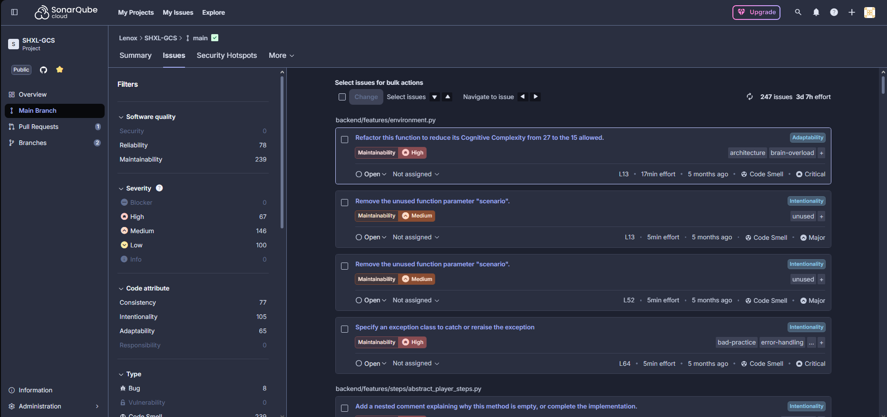
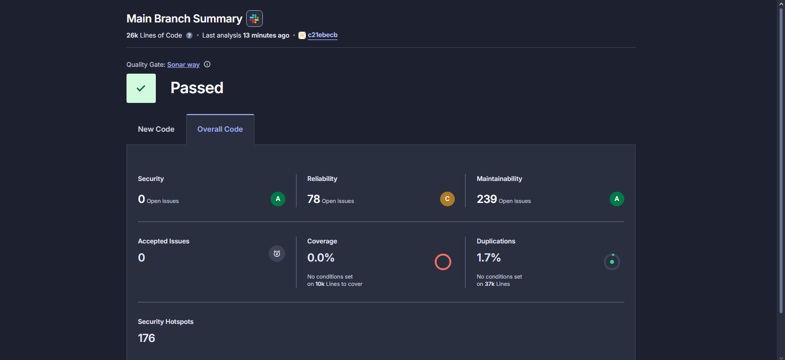
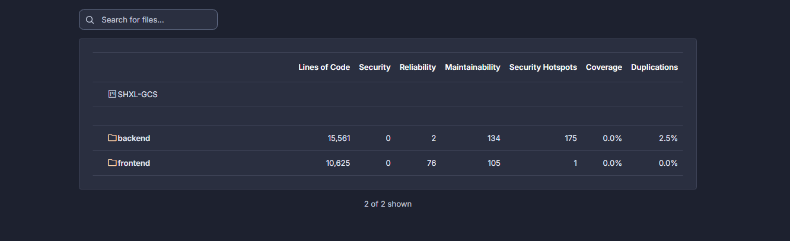
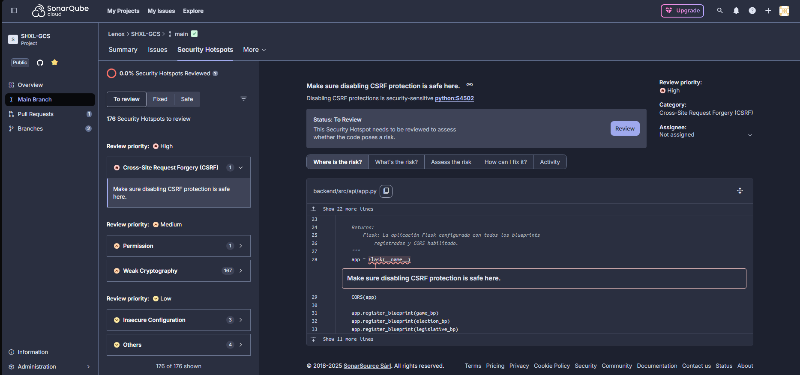

# Integración de SonarQube con GitHub Actions

## 📋 Tabla de Contenidos
- [Introducción](#introducción)
- [Configuración del Proyecto](#configuración-del-proyecto)
- [Configuración de GitHub Actions](#configuración-de-github-actions)
- [Configuración de SonarQube](#configuración-de-sonarqube)
- [Resultados y Análisis](#resultados-y-análisis)
- [Problemas Encontrados](#problemas-encontrados)

## Introducción

Este documento detalla el proceso de integración de **SonarQube Cloud** con nuestro repositorio de GitHub para realizar análisis estático de código automático en cada push y pull request.

SonarQube nos permite:
- 🔍 Detectar bugs y vulnerabilidades de seguridad
- 📊 Medir la calidad del código (code smells)
- 📈 Obtener métricas de mantenibilidad
- 🔒 Identificar security hotspots

## Configuración del Proyecto

### 1. Archivo `sonar-project.properties`

Creamos el archivo de configuración en la raíz del proyecto:

```properties
sonar.projectKey=Lenox30_SHXL-GCS
sonar.organization=lenox30

# Nombre del proyecto
sonar.projectName=SHXL-GCS

# Rutas del código a analizar
sonar.sources=backend, frontend

# Configuración para Python
sonar.python.version=3.10

# Configuración para JavaScript
sonar.javascript.node.maxspace=4096

# Encoding
sonar.sourceEncoding=UTF-8
```

**Parámetros importantes:**
- `sonar.projectKey`: Identificador único del proyecto en SonarQube
- `sonar.organization`: Organización de SonarQube Cloud
- `sonar.sources`: Directorios que contienen el código fuente a analizar

## Configuración de GitHub Actions

### 2. Workflow de CI/CD (`.github/workflows/build.yml`)

Configuramos el workflow para ejecutar el análisis de SonarQube:

```yaml
name: Build
on:
  push:
    branches:
      - ImplementationSonar
      - main
  pull_request:
    types: [opened, synchronize, reopened]

jobs:
  sonarqube:
    name: SonarQube
    runs-on: windows-latest

    steps:
      - uses: actions/checkout@v4
        with:
          fetch-depth: 0  # Importante para el análisis completo

      - name: Set up Python
        uses: actions/setup-python@v4
        with:
          python-version: '3.10'

      - name: Install Python deps (opcional)
        run: pip install -r requirements.txt || true

      - name: SonarQube Scan
        uses: SonarSource/sonarqube-scan-action@v6
        env:
          SONAR_TOKEN: ${{ secrets.SONAR_TOKEN }}
```

**Características del workflow:**
- ✅ Se ejecuta en cada push a las ramas `main` e `ImplementationSonar`
- ✅ Se ejecuta en pull requests (opened, synchronize, reopened)
- ✅ Usa `fetch-depth: 0` para obtener todo el historial de Git (necesario para análisis de código nuevo)
- ✅ Instala dependencias de Python antes del análisis
- ✅ Utiliza el token de SonarQube almacenado en GitHub Secrets

### 3. Configuración del Token en GitHub

Para que GitHub Actions pueda comunicarse con SonarQube Cloud, necesitamos:

1. **Generar token en SonarQube Cloud:**
   - Ir a Account → Security → Generate Token
   - Copiar el token generado

2. **Configurar Secret en GitHub:**
   - Ir a Settings → Secrets and variables → Actions
   - Crear un nuevo secret llamado `SONAR_TOKEN`
   - Pegar el token de SonarQube

## Configuración de SonarQube

### 4. Panel de SonarQube Cloud



En el panel de SonarQube podemos observar:

**Métricas del proyecto:**
- 📊 **239 Issues** detectados con un esfuerzo estimado de **3d 6h**
- 🔴 **67 High severity** issues
- 🟠 **146 Medium severity** issues  
- 🟡 **100 Low severity** issues

**Categorías de problemas:**
- **Reliability (70)**: Bugs que pueden causar comportamientos incorrectos
- **Maintainability (239)**: Code smells que afectan la mantenibilidad
- **Security (0)**: Sin vulnerabilidades detectadas

**Tipos de issues:**
- **Bug (8)**: Errores que deben corregirse
- **Code Smell (239)**: Problemas de mantenibilidad

**Filtros disponibles:**
- Por severidad: High, Medium, Low
- Por tipo: Bug, Vulnerability, Code Smell
- Por atributo de código: Consistency, Intentionality, Adaptability

### 5. Dashboard Principal - Quality Gate



El dashboard principal muestra el estado del **Quality Gate**:

**Estado del Análisis:**
- ✅ **Quality Gate: Passed** (Sonar way)
- 📊 **26k Lines of Code**
- 🕐 Last analysis: 13 minutes ago

**Métricas por Categoría:**
- 🔒 **Security**: 0 Open Issues - Rating: A
- 🐛 **Reliability**: 78 Open Issues - Rating: C
- 🔧 **Maintainability**: 239 Open Issues - Rating: A

**Otras Métricas:**
- ✅ **Accepted Issues**: 0
- 📊 **Coverage**: 0.0% (No conditions set on 10k Lines to cover)
- 🔄 **Duplications**: 1.7% (No conditions set on 37k Lines)
- ⚠️ **Security Hotspots**: 176 to review

### 6. Análisis por Módulo



SonarQube analiza el proyecto dividido en módulos:

**Backend (15,561 líneas):**
- Security: 0 issues
- Reliability: 2 issues
- Maintainability: 134 issues
- Security Hotspots: 175
- Coverage: 0.0%
- Duplications: 2.5%

**Frontend (10,625 líneas):**
- Security: 0 issues
- Reliability: 76 issues
- Maintainability: 105 issues
- Security Hotspots: 1
- Coverage: 0.0%
- Duplications: 0.0%

### 7. Security Hotspots



SonarQube identificó **176 Security Hotspots** que requieren revisión manual:

- 🔴 **1 Cross-Site Request Forgery (CSRF)** - High Priority
  - Ubicación: `backend/src/api/app.py` línea 28
  - Advertencia: "Make sure disabling CSRF protection is safe here"
  - Se detectó el uso de `app = Flask(__name__)` con CSRF deshabilitado

- 🟠 **Permission (1)** - Medium Priority
- 🟠 **Weak Cryptography (167)** - Medium Priority
- 🟡 **Insecure Configuration (3)** - Low Priority
- 🟡 **Others (4)** - Low Priority

**Status:** 0.0% de Security Hotspots revisados

## Resultados y Análisis

### 8. Ejecución en GitHub Actions


El workflow se ejecutó exitosamente con los siguientes pasos:

1. ✅ **Set up job** (3s)
2. ✅ **Run actions/checkout@v4** (8s)
3. ✅ **Set up Python** (8s)
4. ✅ **Install Python deps (opcional)** (1m 13s)
5. ✅ **SonarQube Scan** (1m 28s) - ⭐ Paso principal
6. ✅ **Post Set up Python** (8s)
7. ✅ **Post Run actions/checkout@v4** (2s)
8. ✅ **Complete job** (8s)

**Tiempo total de ejecución:** ~3 minutos

## Problemas Encontrados

### Issues de Alta Prioridad

Según el análisis de SonarQube, los principales problemas a resolver son:

1. **Complejidad Cognitiva (backend/features/environment.py)**
   - 🔴 High Priority - Maintainability
   - Cognitive Complexity: 27 (máximo permitido: 15)
   - Esfuerzo: 17min
   - Tags: `architecture`, `brain-overload`

2. **Parámetros de función sin usar**
   - 🟠 Medium Priority - Maintainability  
   - Múltiples ocurrencias del parámetro "scenario" sin usar
   - Esfuerzo: 5min cada uno
   - Tag: `unused`

3. **Manejo de excepciones**
   - 🔴 High Priority - Maintainability
   - "Specify an exception class to catch or reraise the exception"
   - Esfuerzo: 5min
   - Tags: `bad-practice`, `error-handling`

4. **Métodos vacíos (backend/features/steps/abstract_player_steps.py)**
   - 🟢 Low Priority - Intentionality
   - "Add a nested comment explaining why this method is empty, or complete the implementation"

## Conclusiones

La integración de SonarQube ha sido exitosa y nos proporciona:

- ✅ Análisis automático en cada commit y PR
- ✅ Visibilidad completa de la calidad del código
- ✅ Detección temprana de bugs y vulnerabilidades
- ✅ Métricas cuantificables para mejorar el código

**Estado actual del proyecto:**
- 239 issues detectados
- 0 vulnerabilidades de seguridad críticas
- 176 security hotspots pendientes de revisión
- Technical debt: 3 días 6 horas


